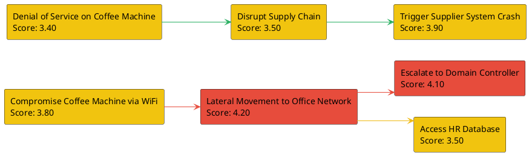

# CyberPath

<!--
MIT License

Copyright (c) 2024 Chris

Permission is hereby granted, free of charge, to any person obtaining a copy
of this software and associated documentation files (the "Software"), to deal
in the Software without restriction, including without limitation the rights
to use, copy, modify, merge, publish, distribute, sublicense, and/or sell
copies of the Software, and to permit persons to whom the Software is
furnished to do so, subject to the following conditions:

The above copyright notice and this permission notice shall be included in all
copies or substantial portions of the Software.

THE SOFTWARE IS PROVIDED "AS IS", WITHOUT WARRANTY OF ANY KIND, EXPRESS OR
IMPLIED, INCLUDING BUT NOT LIMITED TO THE WARRANTIES OF MERCHANTABILITY,
FITNESS FOR A PARTICULAR PURPOSE AND NONINFRINGEMENT. IN NO EVENT SHALL THE
AUTHORS OR COPYRIGHT HOLDERS BE LIABLE FOR ANY CLAIM, DAMAGES OR OTHER
LIABILITY, WHETHER IN AN ACTION OF CONTRACT, TORT OR OTHERWISE, ARISING FROM,
OUT OF OR IN CONNECTION WITH THE SOFTWARE OR THE USE OR OTHER DEALINGS IN THE
SOFTWARE.
-->

Automated attack path visualization and assessment for penetration testing.

## Features

- YAML-based definition of attack paths, including recursive subpaths
- Automatic visualization as PlantUML diagram (PNG)
- Scoring of paths and all nested subpaths by severity, feasibility, and required expertise
- Automatic generation of a Markdown report
- Comparison of all full attack chains with cumulative scores

## Requirements

- Python 3.x
- Java (for PlantUML)
- `plantuml.jar` in the project directory
- Python packages: `pyyaml`, `markdown`

Install required packages:
```bash
pip install pyyaml markdown
```

## Example: Attacks on a WiFi-connected Coffee Machine

Create a YAML file, e.g., `example_coffee_attack.yaml`:
```yaml
attack_paths:
  - name: "Compromise Coffee Machine via WiFi"
    severity: 4
    feasibility: 4
    expertise: 3
    steps:
      - from: "Attacker"
        to: "Coffee Machine"
        action: "Exploit WiFi vulnerability"
      - from: "Coffee Machine"
        to: "Backend Server"
        action: "Send malicious request"
      - from: "Backend Server"
        to: "Coffee Bean Supplier"
        action: "Manipulate order data"
    subpaths:
      - name: "Lateral Movement to Office Network"
        severity: 5
        feasibility: 3
        expertise: 4
        steps:
          - from: "Coffee Machine"
            to: "Office Printer"
            action: "Pivot via open port"
          - from: "Office Printer"
            to: "Internal File Server"
            action: "Access sensitive files"
        subpaths:
          - name: "Escalate to Domain Controller"
            severity: 5
            feasibility: 2
            expertise: 5
            steps:
              - from: "Internal File Server"
                to: "Domain Controller"
                action: "Exploit SMB vulnerability"
          - name: "Access HR Database"
            severity: 4
            feasibility: 3
            expertise: 3
            steps:
              - from: "Internal File Server"
                to: "HR Database"
                action: "Steal employee data"
  - name: "Denial of Service on Coffee Machine"
    severity: 3
    feasibility: 5
    expertise: 2
    steps:
      - from: "Attacker"
        to: "Coffee Machine"
        action: "Flood with requests"
    subpaths:
      - name: "Disrupt Supply Chain"
        severity: 4
        feasibility: 3
        expertise: 3
        steps:
          - from: "Coffee Machine"
            to: "Backend Server"
            action: "Send malformed data"
          - from: "Backend Server"
            to: "Coffee Bean Supplier"
            action: "Interrupt orders"
        subpaths:
          - name: "Trigger Supplier System Crash"
            severity: 5
            feasibility: 2
            expertise: 4
            steps:
              - from: "Coffee Bean Supplier"
                to: "Supplier Database"
                action: "Exploit buffer overflow"
```

## Usage

Run the script with your YAML file:
```bash
python cyberPath.py example_coffee_attack.yaml
```

### Running with the Example File

To generate a report for the coffee machine attack scenarios, use:
```bash
python cyberPath.py example_coffee_attack.yaml
```
This will create the following files in the `output` directory:
- `attack_paths.png` – Visualization of the attack paths
- `pentest_report.md` – Markdown report including the diagram, scoring table, and full attack chain comparison

## Notes

- Ensure `plantuml.jar` is in the project directory or adjust the `PLANTUML_JAR_PATH` variable in the script.
- Java is required for PNG generation.

## Example Output



### Scoring Table

| Path / Subpath                         | Severity | Feasibility | Expertise | Score |
|----------------------------------------|----------|-------------|-----------|-------|
| Compromise Coffee Machine via WiFi     | 4        | 4           | 3         | 3.70  |
| └─ Lateral Movement to Office Network  | 5        | 3           | 4         | 4.10  |
| └─ └─ Escalate to Domain Controller    | 5        | 2           | 5         | 4.10  |
| └─ └─ Access HR Database               | 4        | 3           | 3         | 3.50  |
| Denial of Service on Coffee Machine    | 3        | 5           | 2         | 3.50  |
| └─ Disrupt Supply Chain                | 4        | 3           | 3         | 3.50  |
| └─ └─ Trigger Supplier System Crash    | 5        | 2           | 4         | 4.10  |

### Full Attack Chain Comparison

| Full Attack Chain                                                                 | Cumulative Score |
|----------------------------------------------------------------------------------|------------------|
| Compromise Coffee Machine via WiFi → Lateral Movement to Office Network → Escalate to Domain Controller | 3.97             |
| Compromise Coffee Machine via WiFi → Lateral Movement to Office Network → Access HR Database            | 3.77             |
| Denial of Service on Coffee Machine → Disrupt Supply Chain → Trigger Supplier System Crash              | 3.70             |
| Compromise Coffee Machine via WiFi                                                                 | 3.70             |
| Denial of Service on Coffee Machine → Disrupt Supply Chain                                           | 3.50             |
| Denial of Service on Coffee Machine                                                                 | 3.50             |
