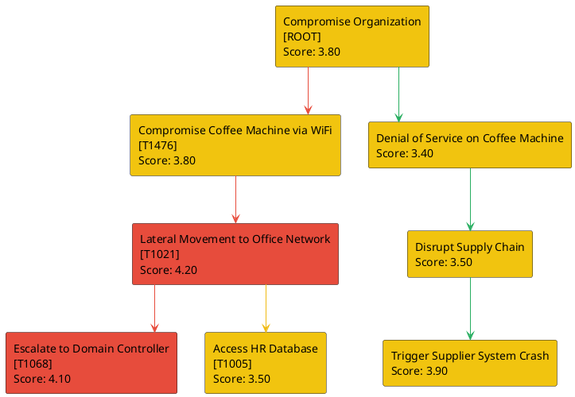

# Pentest Attack Paths Report

## Attack Path Diagram



## Schneier-style Attack Tree

```
- Compromise Organization [ROOT] (Score: 3.80)
    (OR)
    - Compromise Coffee Machine via WiFi [T1476] (Score: 3.80)
        - Lateral Movement to Office Network [T1021] (Score: 4.20)
            (OR)
            - Escalate to Domain Controller [T1068] (Score: 4.10)
            - Access HR Database [T1005] (Score: 3.50)
    - Denial of Service on Coffee Machine (Score: 3.40)
        - Disrupt Supply Chain (Score: 3.50)
            - Trigger Supplier System Crash (Score: 3.90)
```

## Scoring Table

| Path / Subpath | Technique | Severity | Feasibility | Expertise | Score |
|---|---|---|---|---|---|
| Compromise Organization | ROOT | 4 | 4 | 3 | 3.80 |
| └─ Compromise Coffee Machine via WiFi | T1476 | 4 | 4 | 3 | 3.80 |
| └─ └─ Lateral Movement to Office Network | T1021 | 5 | 3 | 4 | 4.20 |
| └─ └─ └─ Escalate to Domain Controller | T1068 | 5 | 2 | 5 | 4.10 |
| └─ └─ └─ Access HR Database | T1005 | 4 | 3 | 3 | 3.50 |
| └─ Denial of Service on Coffee Machine |  | 3 | 5 | 2 | 3.40 |
| └─ └─ Disrupt Supply Chain |  | 4 | 3 | 3 | 3.50 |
| └─ └─ └─ Trigger Supplier System Crash |  | 5 | 2 | 4 | 3.90 |

## Full Attack Chain Comparison

| Full Attack Chain | Cumulative Score |
|---|---|
| Compromise Organization → Compromise Coffee Machine via WiFi → Lateral Movement to Office Network → Escalate to Domain Controller | 3.98 |
| Compromise Organization → Compromise Coffee Machine via WiFi → Lateral Movement to Office Network → Access HR Database | 3.83 |
| Compromise Organization → Denial of Service on Coffee Machine → Disrupt Supply Chain → Trigger Supplier System Crash | 3.65 |
